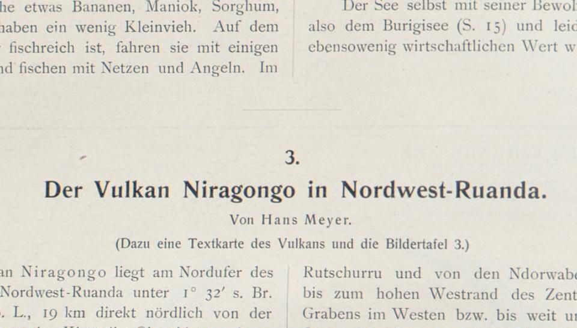

layout: true
  
<div class="my-header"></div>

<div class="my-footer">
  <table>
    <tr>
      <td style="text-align:right">Sächsische Landesbibliothek – Staats- und Universitätsbibliothek</td>
      <td>29. April 2019</td>
      <td style="text-align:right"><a href="https://www.slub-dresden.de/">www.slub-dresden.de</a></td>
    </tr>
    <tr>
      <td style="text-align:right">Referat 2.5</td>
      <td />
    </tr>
  </table>
</div>

<div class="my-title-footer">
  <table>
    <tr>
      <td style="text-align:left"><b>Kay-Michael Würzner</b></td>
    </tr>
    <tr>
      <td style="text-align:left">Referat 2.5</td>
    </tr>
    <tr>
      <td style="font-size:8pt"><b>29. April 2019</b></td>
    </tr>
    <tr>
      <td style="font-size:8pt">XML/TEI-Fortbildung</td>
    </tr>
  </table>
</div>

---

class: title-slide
count: false

# Automatische Erzeugung von TEI-XML
## aus SLUB-Bestandsdaten 

---

# Überblick

- Motivation
- Datengrundlage
- Methode
- Anwendungsperspektive

---

class: part-slide
count: false

# Motivation

---

# Motivation

- **TEI**: weitverbreiteter Standard in den Text ver- und bearbeitenden Wissenschaften
  + Anschluss an bestehende Forschungsinfrastrukturen
  + DFG: *Best Practice* für Editionsprojekte
- Standardformate in Bibliotheken:
  + MODS: bibliothekarische Metadaten
  + METS: Strukturdaten
  + ALTO: Volltexte
- Transformationsszenario zur Erhöhung der **Reichweite**
- **Herausforderung**: nicht-triviale Abbildung zwischen **Stand-Off-** (METS/ALTO) und **Inline-**Kodierung (TEI) struktureller Information

---

class: part-slide
count: false

# Datengrundlage

---

# Datengrundlage: MODS

- MODS: *Metadata Object Description Schema*
  + XML-Format zur Kodierung bibliographischer Metadaten
  + hoher Freiheitsgrad
  + ausspezifiziert im [MODS-Anwendungsprofil](https://dfg-viewer.de/fileabmin/groups/dfgviewer/MODS-Anwendungsprofil_2.3.1.pdf)
- Beispiel:
  ```xml
      <mods>
          <titleInfo>
              <title>Dresden und die Sächsische Schweiz</title>
          </titleInfo>
          <name type="personal">
              <role>
                  <roleTerm type="text">creator</roleTerm>
              </role>
              <namePart>Gottschalck, Friedrich</namePart>
          </name>
      </mods>
  ```

---

# Datengrundlage: METS

- METS: *Metadata Encoding & Transmission Standard*
  + XML-Format zur Repräsentation digitaler Objekte
  + hoher Freiheitsgrad
  + ausspezifiziert im [METS-Anwendungsprofil](https://dfg-viewer.de/fileabmin/groups/dfgviewer/METS-Anwendungsprofil_2.3.1.pdf)
  + **Kontainerformat**: enthält bspw. MODS
- Grundstruktur:
  ```xml
      <mets>
          <metsHdr/>
          <dmdSec/>
          <amdSec/>
          <fileSec/>
          <structMap/>
          <structLink/>
      </mets>
  ```
---

# Datengrundlage: ALTO

- ALTO: *Analyzed Layout and Text Object*
  + XML-Format zur Repräsentation digitaler Volltexte
  + Text- und Strukturinformation auf **Seitenebene**
  + Rückbindung ans Digitalisat über **Koordinaten**
  + von praktisch allen OCR-Programmen unterstützt
- Beispiel

---

# Datengrundlage: Gegenüberstellung zu TEI

- **bibliographische Metadaten**
  + *MMA*: separat realisiert im MODS-Teil
  + *TEI*: quasi separat realisiert im `teiHeader`
- **Struktur**
  + *MMA*: Sequenz von `div`-Elementen, getrennt vom Text (Standoff, verknüpft auf Seitenebene)
  + *TEI*: im Textteil als integrierte Sequenz von verschachtelten `div`-Elementen
- **Text**
  + *MMA*: pro Seite separiert auf Seitenebene als Sequenz von Absätzen und Zeilen
  + *TEI*: in die Dokumentstruktur integriert als Sequenz von Absätzen und Zeilen

---

class: part-slide
count: false

# Methode

---

# Methode

- **Ziel**: automatische Transformation von *MMA* nach *TEI*
- trivial auf der Ebene der bibliographischen Metadaten
- nicht-trivial auf der Text-Struktur-Ebene
- **Idee**:
  + verschachtelte `div`-Ebene als Basis der TEI-Datei
  + Einfügen des Textes auf Absatzebene
  ```xml
    <mets:structMap TYPE="LOGICAL">
        <mets:div ADMID="AMD" ...>
            <mets:div LABEL="Vorbericht" TYPE="chapter" />
            <mets:div LABEL="Kapitel 1" TYPE="chapter">
                <mets:div LABEL="Abschnitt 1.1" TYPE="chapter" />
            </mets:div>
            <mets:div LABEL="Kapitel 2" TYPE="chapter" />
        </mets:div>
    </mets:structMap>
  ```

---

# Methode

- **Problem**:
  + Stuktur und Text in den SLUB-Daten nur auf Seitenebene
  + i.e. keine Information, **wo** sich die Überschrift auf der Seite befindet
  ```xml
      <mets:structLink>
          <mets:smLink xlink:to="PHYS_0001" xlink:from="LOG_0000" />
      </mets:structLink>
  ```
- **„Lösung“**:
      + *Lokalisierung* des Strukturelements via `LABEL` auf der Seite
      + Vergleich des zu lokalisierenden Textes `\(t\)` mit allen Positionen `\(i\)` in der OCR `\(O=o_1\ldots o_n\)`
      + minimaler Editierabstand zwischen `\(t\)` und `\(o_i\ldots o_{i+|t|}\)` als Platzierungskriterium
      + Inklusion aller Zeilen, die Teile der optimalen OCR-Sequenz enthalten

---

# Methode


  
```xml
  <div TYPE="section"
       LABEL="3. Der Vulkan Niragongo in Nordwest-Ruanda" />
```
```xml
  <TextBlock>
      <TextLine>
          <String CONTENT="2" />
      </TextLine>
      <TextLine>
          <String CONTENT="Dcr" />
          <SP />
          <String CONTENT="Vulkan" />
          <SP />
          <String CONTENT="Niragongo" />
      ...
```

---

class: part-slide
count: false

# Methode

---

class: part-slide

# Vielen Dank für Ihre Aufmerksamkeit!

<center>
<a href="https://wrznr.github.io/mets-mods2tei/presentations/slub_april_2020/slub_aplril_2020.html">wrznr.github.io/mets-mods2tei</a>
</center>
